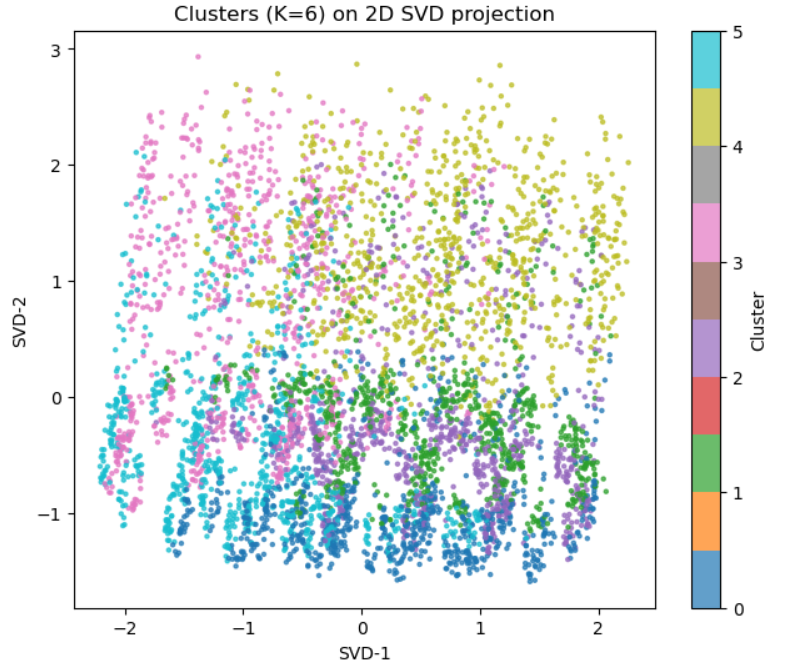

# Data analysis agent

## Setting the environment

The agent was developed in a conda environment. Please follow the steps below to reproduce the environment.

```bash
conda create --name smolagents python=3.11

conda activate smolagents

pip install "smolagents[all]"

conda install -c anaconda -c conda-forge matplotlib jupyter ipywidgets tqdm seaborn scikit-learn
```

## Running the agent

### From terminal
```bash
python data_analysis_agent.py
```

The script will ask the query and other information.

### From a jupyter notebook
```python
import data_analysis_agent

data_analysis_agent.run(
    query="What was the average scheduled quantity in 2022?", # replace with your query
    data_filepath='pipeline_data.parquet', # replace with the location of the data file
    processed_data_dirpath='data', # replace as needed
    api_key='', # Please enter your openai key here
)
```

Running from a notebook is preferred since the agent can embed plots in it's final report.

The runnning agent will print it's reasoning and generated code at each iteration.

## Brief note about the agent

The agent was built using Hugginface's smolagents framework. The agent was tweaked, though, to work as 
an "adaptive planner". This was done by setting it to produce a plan at each iteration and then keep each iteration short. The idea was to make it more iterative so that it could explore and change it's plan according to observations.

## Examples

### Clustering
query = 'try to find any data clusters'
#### response
Final answer: Clustering analysis report on pipeline data

Dataset and preprocessing
- Dataset: 19,703,756 rows × 11 columns (no missing values).
- Encoded categorical columns with provided mappings: pipeline_name, loc_name, connecting_entity, category_short, 
state_abb, county_name.
- Working sample for clustering: 112,986 rows, stratified by category_short (~8,000 per category).
- Features used:
  - Numeric: log1p(scheduled_quantity), year, and cyclical encodings for month and day_of_month (sin/cos).
  - Categorical (one-hot): pipeline_name, state_abb, category_short, rec_del_sign, and county_name (top 200; others
grouped).
- Dimensionality reduction: TruncatedSVD to 50 components, retaining 91.0% of variance.

Clustering method and quality
- Algorithm: MiniBatchKMeans evaluated at K in {4, 6, 8, 10}.
- Selected number of clusters: K = 6 (highest silhouette).
- Silhouette score (on a 20k subsample of the reduced space): 0.0799.
- Note: silhouette around 0.08 indicates some structure but also significant overlap among clusters.

High-level univariate signals
- scheduled_quantity is highly skewed (median ~1; 90th percentile ~48k; 99th ~446k; max ~3.3M).
- rec_del_sign is imbalanced: -1 more frequent than +1 overall in the full dataset.

Cluster profiles (decoded names shown)
Cluster 0  — size 18,424 (16.3%)
  - scheduled_quantity (original units): mean 154, median 0, p90 196, p99 4000
  - rec_del_sign counts: -1: 9790, 1: 8634  (treat -1 and 1 as categories)
  - Top category_short: Park & Loan (1831); Pooling Point (1739); Other (1621); Accounting (1549); LDC (1383)
  - Top pipeline_name: Northwest Pipeline GP (2237); Northern Natural Gas Company (1012); Columbia Gas 
Transmission, LLC (996); Rockies Express Pipeline LLC (984); Enable Gas Transmission (959)
  - Top state_abb: TX (2478); WY (2112); CO (1808); LA (1588); OK (825)
  - Top county_name: Lincoln (1119); Rio Blanco (605); Fairfield (511); Sweetwater (435); Weld (399)
  - Months with highest activity: 7 (4707), 6 (4486), 8 (3809)

Cluster 1  — size 19,069 (16.9%)
  - scheduled_quantity (original units): mean 420, median 0, p90 408, p99 9933
  - rec_del_sign counts: -1: 10619, 1: 8450  (treat -1 and 1 as categories)
  - Top category_short: Pooling Point (1750); Park & Loan (1674); Other (1536); Accounting (1509); LDC (1482)
  - Top pipeline_name: Northwest Pipeline GP (2120); Northern Natural Gas Company (1132); Enable Gas Transmission 
(1074); Columbia Gas Transmission, LLC (1011); Rockies Express Pipeline LLC (993)
  - Top state_abb: TX (2652); WY (1966); CO (1732); LA (1590); OK (977)
  - Top county_name: Lincoln (1025); Fairfield (580); Rio Blanco (513); Weld (423); Sweetwater (421)
  - Months with highest activity: 3 (4104), 4 (3633), 2 (3585)

Cluster 2  — size 17,572 (15.6%)
  - scheduled_quantity (original units): mean 4231, median 0, p90 3333, p99 99735
  - rec_del_sign counts: -1: 9548, 1: 8024  (treat -1 and 1 as categories)
  - Top category_short: Park & Loan (1651); Other (1453); Pooling Point (1437); LDC (1333); Industrial (1320)
  - Top pipeline_name: Northwest Pipeline GP (2107); Northern Natural Gas Company (1028); Gulf South Pipeline 
Company, LP (1008); Columbia Gas Transmission, LLC (937); Enable Gas Transmission (916)
  - Top state_abb: TX (2425); WY (1852); CO (1521); LA (1475); OK (989)
  - Top county_name: Lincoln (969); Fairfield (505); Rio Blanco (447); Sweetwater (384); Weld (350)
  - Months with highest activity: 3 (4332), 2 (3598), 1 (3541)

Cluster 3  — size 18,511 (16.4%)
  - scheduled_quantity (original units): mean 56984, median 408, p90 111932, p99 1201093
  - rec_del_sign counts: -1: 10622, 1: 7889  (treat -1 and 1 as categories)
  - Top category_short: Compressor (1765); Power (1628); Segment (1505); Interconnect (1488); Industrial (1475)
  - Top pipeline_name: Northwest Pipeline GP (1545); Gulf South Pipeline Company, LP (1343); Texas Eastern 
Transmission, LP (1218); Cimarron River Pipeline (1136); Northern Natural Gas Company (995)
  - Top state_abb: TX (2449); LA (1960); WY (1334); OK (1288); CO (1007)
  - Top county_name: Beaver (538); Lincoln (527); Cameron Parish (423); Fairfield (406); Campbell (328)
  - Months with highest activity: 12 (4329), 11 (4270), 10 (3483)

Cluster 4  — size 19,462 (17.2%)
  - scheduled_quantity (original units): mean 213035, median 54064, p90 674583, p99 1558943
  - rec_del_sign counts: -1: 11568, 1: 7894  (treat -1 and 1 as categories)
  - Top category_short: Segment (3920); Power (2301); Interconnect (2119); LNG (2089); Compressor (1705)
  - Top pipeline_name: Northwest Pipeline GP (3081); Gulf South Pipeline Company, LP (2178); Texas Eastern 
Transmission, LP (1951); Cimarron River Pipeline (1116); Columbia Gulf Transmission Company (676)
  - Top state_abb: LA (3516); TX (2082); WA (1433); PA (1337); MS (1166)
  - Top county_name: Cameron Parish (1150); Acadia Parish (728); Beaver (497); Lamar (487); Lincoln (459)
  - Months with highest activity: 6 (3255), 5 (3200), 7 (3043)

Cluster 5  — size 19,948 (17.7%)
  - scheduled_quantity (original units): mean 2256, median 0, p90 1336, p99 55000
  - rec_del_sign counts: -1: 11132, 1: 8816  (treat -1 and 1 as categories)
  - Top category_short: Pooling Point (1827); LDC (1670); Accounting (1585); Park & Loan (1560); Industrial (1558)
  - Top pipeline_name: Northwest Pipeline GP (2059); Northern Natural Gas Company (1213); Rockies Express Pipeline 
LLC (1046); Tennessee Gas Pipeline Company (1034); Enable Gas Transmission (1033)
  - Top state_abb: TX (2667); WY (2053); LA (1666); CO (1663); OK (1066)
  - Top county_name: Lincoln (1044); Fairfield (561); Rio Blanco (488); Sweetwater (439); Weld (415)
  - Months with highest activity: 10 (4006), 9 (3976), 8 (3772)

Visualization
- A 2D TruncatedSVD scatter colored by cluster was saved to: clusters_svd2_scatter.png
  The projection shows overlapping but discernible groups consistent with the modest silhouette score.

Interpretation and insights
- Clusters differentiate along a combination of:
  1) Pipeline systems (top pipeline_name per cluster),
  2) Geography (state_abb and county_name concentrations),
  3) Operational categories (category_short) and the receipt/delivery mix (rec_del_sign),
  4) Volume regime (scheduled_quantity statistics).
- The presence of distinct top pipelines and states within clusters suggests operational or regional segmentation.
- Seasonality appears in some clusters (months with higher activity).

Caveats and limitations
- This analysis used a ~113k stratified sample to keep computation tractable; full-population clustering could 
refine boundaries.
- High-cardinality fields (loc_name, connecting_entity) were excluded from one-hot to avoid extreme sparsity; 
including them via hashing or frequency/target encoding may sharpen clusters.
- rec_del_sign semantics (-1 vs +1) were treated as categorical without domain interpretation; future work should 
map these to 'receipt' vs 'delivery' explicitly.
- KMeans relies on Euclidean geometry and can be sensitive to scaling and initialization; alternative models (e.g.,
HDBSCAN on UMAP, k-prototypes for mixed data) may capture nonlinear or categorical structure better.
- The heavy-tailed scheduled_quantity may still influence distances despite log1p; robust scaling or winsorization 
could be explored.
- PCA/SVD is linear; nonlinear embeddings might reveal clearer separation.

Next steps
- Evaluate clustering stability across different random samples and seeds.
- Try separate clustering for -1 vs +1 rec_del_sign subsets to reduce heterogeneity.
- Incorporate loc_name and connecting_entity via hashing encoders; test larger top-N for county_name.
- Consider UMAP + HDBSCAN or k-prototypes to better handle mixed types.
- Track cluster evolution over time (year, month) to detect temporal regime shifts.
[Step 5: Duration 73.15 seconds| Input tokens: 87,039 | Output tokens: 17,248]


### Simple query
query = "What was the average scheduled quantity in 2022?"
#### response
Final answer: Average scheduled quantity in 2022: 21,843.62

Methodology
- Data source: /mnt/StorageHD/data/synmax/pipeline_data/data_df.csv
- Computation: Arithmetic mean of scheduled_quantity for all rows where year == 2022.
- Missing/invalid handling: Non-numeric or non-finite scheduled_quantity values were excluded from the averaging.

Data coverage and quality (2022)
- Total rows in 2022: 5416908
- Valid rows used: 5416908
- Missing/invalid scheduled_quantity: 0 (0.00% of 2022 rows)

Distribution of scheduled_quantity in 2022
- Median: 1.00
- Standard deviation: 95,907.33
- 10th percentile: 0.00
- 90th percentile: 42,894.30
- Min: 0.00
- Max: 3,250,000.00

Monthly context (2022)
  - Month 01: count=450782, mean=24,029.82, median=3.00, min=0.00, max=3,250,000.00
  - Month 02: count=409147, mean=22,797.17, median=2.00, min=0.00, max=2,835,662.00
  - Month 03: count=460842, mean=21,360.56, median=1.00, min=0.00, max=2,760,003.00
  - Month 04: count=447803, mean=20,415.92, median=0.00, min=0.00, max=2,691,186.00
  - Month 05: count=461870, mean=20,669.53, median=0.00, min=0.00, max=2,725,714.00
  - Month 06: count=447281, mean=21,171.84, median=0.00, min=0.00, max=2,884,122.00
  - Month 07: count=460749, mean=21,912.08, median=0.00, min=0.00, max=2,975,698.00
  - Month 08: count=460767, mean=21,796.64, median=1.00, min=0.00, max=2,817,494.00
  - Month 09: count=448144, mean=21,440.42, median=0.00, min=0.00, max=3,008,726.00
  - Month 10: count=460881, mean=21,263.65, median=0.00, min=0.00, max=2,649,510.00
  - Month 11: count=446674, mean=22,117.09, median=1.00, min=0.00, max=2,783,797.00
  - Month 12: count=461968, mean=23,239.85, median=1.00, min=0.00, max=3,250,000.00

Top 10 pipelines by average scheduled quantity (2022)
  - TransCameron Pipeline: mean=555,576.97 (n=1389)
  - Cheniere Creole Trail Pipeline, L.P.: mean=392,207.27 (n=1095)
  - Stagecoach Natural Gas Storage Facility: mean=322,449.21 (n=3603)
  - Rover Pipeline: mean=268,280.08 (n=7683)
  - Cheyenne Connector: mean=244,112.02 (n=1825)
  - Alliance Pipeline LP: mean=230,994.03 (n=6205)
  - White River Hub, LLC: mean=188,750.70 (n=3650)
  - Arkoma Pipeline: mean=175,496.45 (n=1460)
  - Trans-Union Interstate Pipeline, L.P.: mean=173,969.44 (n=1095)
  - Rendezvous Pipeline Company, LLC: mean=155,620.33 (n=730)

Average scheduled quantity by category (2022)
  - LNG: mean=209,365.16 (n=13032)
  - Segment: mean=107,488.78 (n=20392)
  - Interconnect: mean=56,410.74 (n=1184237)
  - Compressor: mean=31,869.17 (n=11367)
  - Accounting: mean=30,262.84 (n=20729)
  - Storage: mean=28,572.83 (n=124523)
  - Power: mean=27,813.53 (n=292352)
  - Production: mean=18,384.64 (n=1258625)
  - LDC: mean=4,663.10 (n=1911759)
  - Industrial: mean=3,243.04 (n=566521)
  - Pooling Point: mean=3,068.69 (n=9855)
  - Other: mean=242.59 (n=1095)
  - Pipeline Fuel: mean=86.33 (n=1326)
  - Not Classified: mean=0.00 (n=1095)

Caveats
- Units: The dataset does not specify the units for scheduled_quantity in the provided schema. Interpret the 
numeric values within your domain context.
- Encoding: Several categorical fields are integer-encoded; names for pipeline_name and category_short have been 
decoded using provided mappings.
- Averaging choice: The reported figure is an unweighted arithmetic mean across all 2022 rows. If a different 
aggregation (e.g., weighted by time or transaction size) is desired, results may differ.
- Potential bias: Averages by pipeline can be influenced by differing observation counts per pipeline. Review the 
counts alongside means for proper context.
[Step 2: Duration 76.28 seconds| Input tokens: 10,517 | Output tokens: 4,407]

```python

```

A bit of an overkill for such a query, but it's a compromise since the agent has to be prepared 
for more complex things.


```python

```
